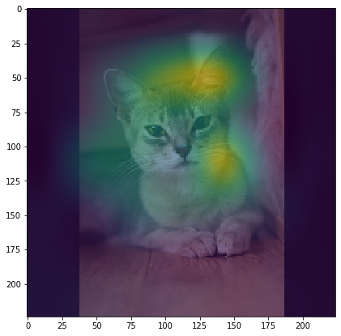
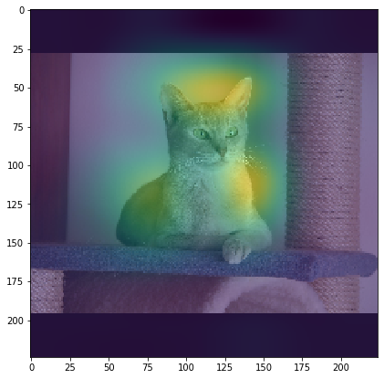
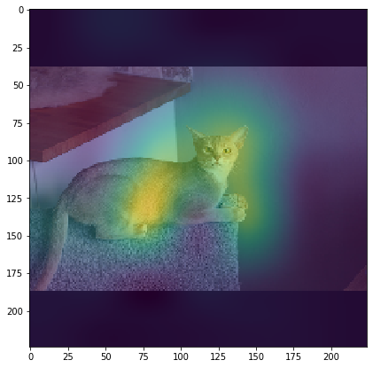

# Grouped Pointwise Convolutions Reduce Parameters in Convolutional Neural Networks
This repository contains the source code for the paper [Grouped Pointwise Convolutions Reduce Parameters in Convolutional Neural Networks (PDF)](https://www.researchgate.net/publication/360226228_Grouped_Pointwise_Convolutions_Reduce_Parameters_in_Convolutional_Neural_Networks).

## Abstract
In Deep Convolutional Neural Networks (DCNNs), the parameter count in pointwise convolutions quickly grows due to the multiplication of the filters and input channels from the preceding layer. To handle this growth, we propose a new technique that makes pointwise convolutions parameter-efficient via employing parallel branching, where each branch contains a group of filters and processes a fraction of the input channels. To avoid degrading the learning capability of DCNNs, we propose interleaving the filters' output from separate branches at intermediate layers of successive pointwise convolutions. To demonstrate the efficacy of the proposed technique, we apply it to various state-of-the-art DCNNs, namely EfficientNet, DenseNet-BC L100, MobileNet and MobileNet V3 Large. The performance of these DCNNs with and without the proposed method is compared on CIFAR-10, CIFAR-100, Cropped-PlantDoc and Oxford-IIIT Pet datasets. The experimental results demonstrated that DCNNs with the proposed technique, when trained from scratch, obtained similar test accuracies to the original EfficientNet and MobileNet V3 Large architectures while saving up to 90% of the parameters and 63% of the floating-point computations.

## Quick Start on Your Own Web Browser
You can quickly give a go to our optimized kEffNet via [Google Colab](https://colab.research.google.com/) on your own browser:
* [kEffNet v1.](https://colab.research.google.com/github/joaopauloschuler/k-neural-api/blob/master/examples/jupyter/kEffNet_v1.ipynb) [](https://colab.research.google.com/github/joaopauloschuler/k-neural-api/blob/master/examples/jupyter/kEffNet_v1.ipynb)

## The Raw Results Folder
If you just need an easy to use example, you can try the Colab example above. Otherwise, you can look at all raw experiment files used for the paper on the [raw](https://github.com/joaopauloschuler/kEffNetV1/tree/main/raw) folder.

## Creating Optimized Models
You can create kEffNet, kDenseNet-BC L100, kInception V3, kMobileNet and kMobileNet V3 Large following the examples below. The parameter `kType` defines the minimum number of channels per group. For example, for a minimum of 16 channels per group, you should use `cai.layers.D6_16ch()`. For 32 channels, you should use `cai.layers.D6_32ch()`.

All examples in this section require importing the [K-CAI Neural API](https://github.com/joaopauloschuler/k-neural-api).

### kEffNet
The example below shows the creation of a kEffNet-B0 16ch:
```
model = cai.efficientnet.kEfficientNetB0(
  include_top=True,
  input_shape=(224, 224, 3),
  classes=10,
  kType=cai.layers.D6_16ch())
```
For loading small images such as CIFAR-10's 32x32 images, you can skip the first strides with the `skip_stride_cnt` parameter as shown in the following example:
```
model = cai.efficientnet.kEfficientNetB0(
  include_top=True,
  skip_stride_cnt=3,
  input_shape=(32, 32, 3),
  classes=10,
  kType=cai.layers.D6_16ch())
```
Other [kEffNet variants](https://github.com/joaopauloschuler/k-neural-api/blob/master/cai/efficientnet.py) up to B7 are also available.

### kDenseNet-BC L100 12ch
In DenseNets, you can define the minimum number of channels per group for transitions (`kTypeTransition`) and for blocks (`kTypeBlock`):
```
model = cai.densenet.ksimple_densenet([32, 32, 3], 
  blocks=16, 
  growth_rate=12, bottleneck=48, compression=0.5,
  l2_decay=0,
  kTypeTransition=cai.layers.D6_12ch(),
  kTypeBlock=cai.layers.D6_12ch(), 
  num_classes=10,
  dropout_rate=0.0,
  activation=keras.activations.swish,
  has_interleave_at_transition=True)
```

### kInception V3 32ch
The example below should work for most use cases:
```
model = cai.inception_v3.two_path_inception_v3(
  include_top=True,
  weights=None,
  input_shape=(224, 224, 3),
  pooling=None,
  classes=num_classes,
  two_paths_partial_first_block=0,
  two_paths_first_block=False,
  two_paths_second_block=False,
  deep_two_paths=False,
  kType=cai.layers.D6_32ch())
```
Some of the parameters such as `two_paths_partial_first_block`, `two_paths_first_block` and `two_paths_second_block` are related to the papaer [Reliable Deep Learning Plant Leaf Disease Classification Based on Light-Chroma Separated Branches](https://github.com/joaopauloschuler/two-path-noise-lab-plant-disease).

### kMobileNet 32ch
The example below creates a basic MobileNet with optimized pointwise convolutions:

```
model = cai.mobilenet.kMobileNet(
  include_top=True,
  weights=None,
  input_shape=(224, 224, 3),
  pooling=None,
  classes=10,
  kType=cai.layers.D6_32ch())
```

### kMobileNet V3 32ch
The example below creates a MobileNet V3 with optimized pointwise convolutions:
```
model = cai.mobilenet_v3.kMobileNetV3Large(
  input_shape=(224, 224, 3),
  alpha=1.0,
  minimalistic=False,
  include_top=True,
  input_tensor=None,
  classes=10,
  pooling=None,
  dropout_rate=0.2,
  kType=cai.layers.D6_32ch())
```
## Class Activation Maps with Oxford-IIIT Pets Dataset
[Class activation maps (CAMs)](https://github.com/joaopauloschuler/kEffNetV1/blob/main/raw/kEffNet/Oxford-IIIT-Pet/CAMs.ipynb) source code used for this paper is available. In this source code, you'll find plenty of images not shown on the paper.

The CAMs are calculated with:
```
  localImageArray = np.array(localImageArray, dtype='float32')
  heat_map = cai.models.calculate_heat_map_from_dense_and_avgpool(aInput=localImageArray[0], target_class=image_class, pModel=model, pOutputLayerName='k_top_conv_group_interleaved', pDenseLayerName='k_probs')
```

Resized with:
```
heat_map_res = cv2.resize(heat_map, dsize=(localImageArray[0].shape[0], localImageArray[0].shape[1]), interpolation=cv2.INTER_CUBIC)
```
And then shown with:
```
plt.figure(figsize = (7, 7))
plt.imshow(heat_map_res, interpolation='nearest', aspect='equal', alpha=1)
plt.imshow(localImageArray[0], interpolation='nearest', aspect='equal', alpha=0.5)
```

<p></img></p>

<p></img></p>

<p></img></p>

## Give this Project a Star
This project is an open source project. If you like what you see, please give it a star on github.

## Further Parameter and Floating-point Computation Savings
The following papers also deal about parameters and floating-point computation savings:
- [Reliable Deep Learning Plant Leaf Disease Classification Based on Light-Chroma Separated Branches.](https://www.researchgate.net/publication/355215213_Reliable_Deep_Learning_Plant_Leaf_Disease_Classification_Based_on_Light-Chroma_Separated_Branches)
- [Grouped Pointwise Convolutions Significantly Reduces Parameters in EfficientNet.](https://www.researchgate.net/publication/355214501_Grouped_Pointwise_Convolutions_Significantly_Reduces_Parameters_in_EfficientNet)
- [Optimizing CNNs first layer with respect to color encoding.](https://www.researchgate.net/publication/357204289_Optimizing_CNNs_first_layer_with_respect_to_color_encoding)

## References
Please refer to the [paper](https://mendel-journal.org/index.php/mendel/article/view/169) regarding the baseline model references.

## Citing this Paper 
```
@article{Schuler_2022_GPCRPNN, 
  title={Grouped Pointwise Convolutions Reduce Parameters in Convolutional Neural Networks}, volume={28}, 
  url={https://mendel-journal.org/index.php/mendel/article/view/169}, 
  number={1}, 
  journal={MENDEL}, 
  author={Schwarz Schuler, Joao Paulo and Romani, Santiago and Abdel-Nasser, Mohamed and Rashwan, Hatem and Puig, Domenec},
  year={2022}, month={Jun.}, pages={23-31} }
```
