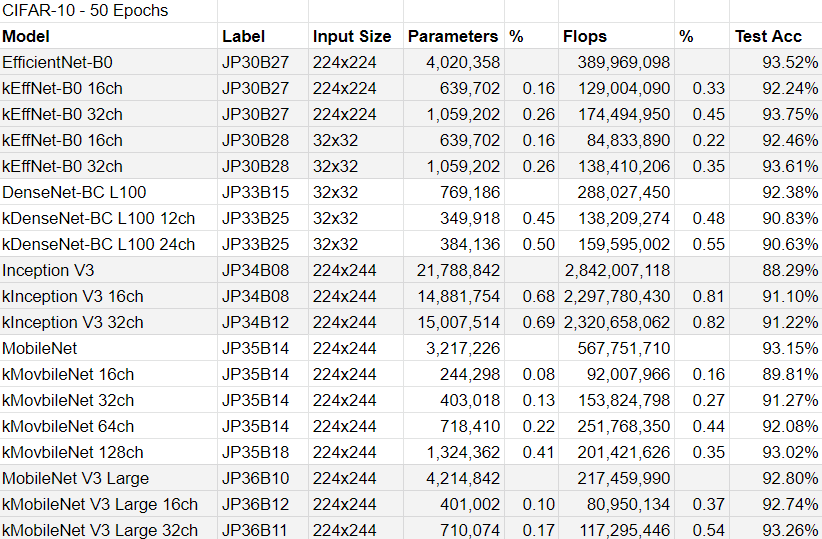
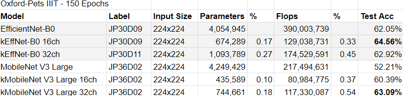

# The Raw Results Folder
This folder is organized as follows: `<model name>/<dataset name>`.
  
Each raw file has a label in its name. The following tables translate these labels.

</img>

</img>

</img>

</img>

